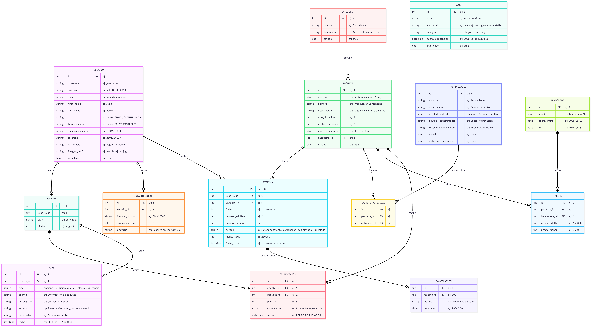

# Documentación del Sistema de Gestión Turística (MNG_WEB)

Este proyecto está desarrollado en **Django** y sigue una arquitectura modular orientada a dominios de negocio. Esta estructura garantiza escalabilidad, fácil mantenimiento y una separación clara de responsabilidades enfocado en la gestión de servicios y paquetes turísticos.

## Modelo Entidad Relación (MER)

A continuación se detalla la estructura de la base de datos, optimizada para el flujo de reservas de paquetes turísticos, gestión de usuarios, catálogo de destinos y participación de la comunidad. 

El modelo completo puede ser visualizado en nuestro archivo de diagramas interactivo:

---

## Arquitectura de Módulos (Apps de Django)

El sistema está dividido en las siguientes aplicaciones principales, respetando la regla de mantener la temática general como el módulo (carpeta) y las entidades como submódulos (modelos).

| Módulo (App Django) | Modelos (Subtemas) | Descripción de Responsabilidades |
| :--- | :--- | :--- |
| **`usuarios`** | `Usuario`, `Cliente`, `GuiaTuristico` | Gestión de cuentas, autenticación y control de acceso. El modelo de usuario diferencia los roles mediante un campo TextChoices (`rol`) y extiende sus perfiles específicos a través de relaciones 1 a 1 (`Cliente` y `GuiaTuristico`). |
| **`catalogo`** | `Categoria`, `Actividades`, `Temporada`, `Tarifa`, `Paquete`, `PaqueteActividad` | Catálogo central del sistema. Gestiona los paquetes turísticos, su agrupación, actividades incluidas y el control dinámico de precios por temporadas (altas, bajas). |
| **`reservas`** | `Reserva`, `Cancelacion` | Motor principal de agendamiento. Administra las reservas con flujos de estado (Pendiente, Confirmada, etc.), calculando automáticamente los montos basados en la temporada y gestiona cancelaciones. |
| **`comunidad`** | `Calificacion`, `Blog`, `PQRS` | Fomenta la interacción de los usuarios. Recopila el feedback de los clientes (`Calificacion`), provee un espacio para artículos o noticias (`Blog`) y maneja el sistema de atención al cliente (`PQRS`). |

---

## Notas de Implementación

*   **Autenticación y Roles:** El modelo `Usuario` extiende de `AbstractUser` de Django. Se manejan los diferentes perfiles del sistema conectando el usuario de autenticación principal a entidades detalladas usando `OneToOneField` y controlando el tipo de acceso mediante el campo enum `rol`.
*   **Cálculos Automáticos y Temporadas:** El monto total de las reservas no se ingresa manualmente; se calcula de manera automática en el método `save()` de la clase `Reserva`, buscando la `Temporada` correspondiente a la fecha de viaje y multiplicando el precio de la `Tarifa` por el número de adultos y menores.
*   **Gestión de Catálogo Complejo:** Para flexibilizar la oferta, los paquetes turísticos y las actividades están enlazados mediante un modelo intermedio `PaqueteActividad` (relación Muchos a Muchos), lo que permite crear paquetes modulares. Además, se detalla la duración en días y noches, y la viabilidad para menores.
*   **Tipado Estricto y Normalización:** Se utilizan clases Enum (`TextChoices` o `choices` nativos) para centralizar las opciones de campos clave como los roles, tipos de documentos, niveles de dificultad y estados de los procesos (PQRS, Reservas), evitando redundancias de datos.
*   **Auditoría Básica:** Las reservas registran automáticamente su momento exacto de creación (`fecha_registro`) independientemente de la fecha programada para el viaje, permitiendo análisis de ventas precisos.
*   **Validaciones de Interacción:** El módulo de comunidad utiliza restricciones en base de datos (`unique_together`) para garantizar que un `Cliente` solo pueda calificar un `Paquete` específico una única vez.
